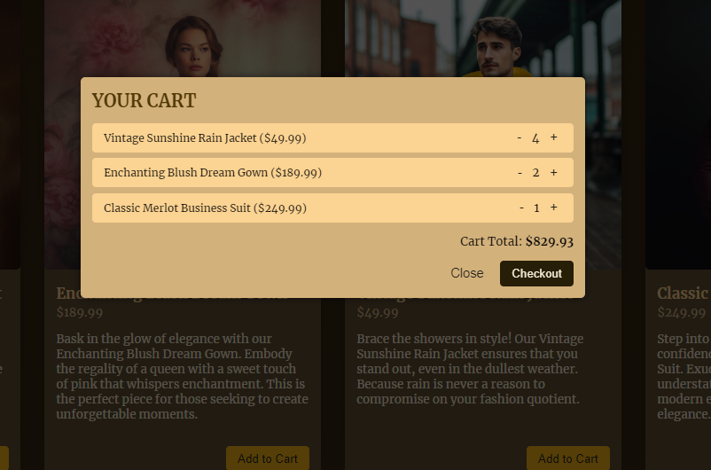

"# ShoppyCart-" 
# ShoppyCart

Welcome to ShoppyCart! ShoppyCart is an elegant shopping app where you can explore a variety of products and add them to your cart seamlessly.

## Features:

- **Product Display:** Browse through a wide range of products elegantly displayed.
- **Add to Cart:** Easily add products to your shopping cart with a single click.
- **Cart Management:** View your cart items and adjust quantities as needed.
- **Total Price Calculation:** Automatically calculates and displays the total price of items in your cart.
- **Responsive Design:** Enjoy a seamless shopping experience across different devices.

## Technologies Used:

- React
- JavaScript
- Context API for state management

## Components:

1. **App.jsx:** The main component orchestrating the header, shop, and product components.
2. **Header.jsx:** Displays the app title, logo, and cart button. Allows users to access their shopping cart.
3. **Shop.jsx:** Renders a list of products available for purchase.
4. **Product.jsx:** Represents an individual product card with options to add it to the cart.
5. **Cart.jsx:** Displays the items in the shopping cart, allows users to adjust quantities, and calculates the total price.
6. **CartModal.jsx:** A modal component that shows the contents of the shopping cart.
7. **ShoppingCartContext.jsx:** Provides context for managing the shopping cart state.

## How to Use:

1. Explore the products displayed on the shop page.
2. Click on "Add to Cart" button to add products to your shopping cart.
3. View your shopping cart by clicking on the cart icon in the header.
4. Adjust the quantities of items in your cart as needed.
5. Proceed to checkout when you're ready to complete your purchase.

Feel free to customize and enhance ShoppyCart to suit your needs. Happy shopping!

## Screenshots

#### Landing Page

#### Cart Modal

## License

This project is licensed under the terms of the MIT license. See the [LICENSE](LICENSE) file for details.
